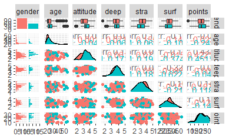
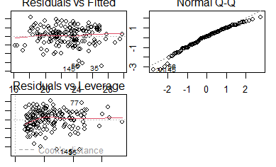
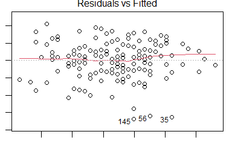
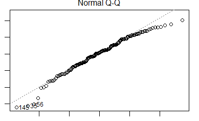
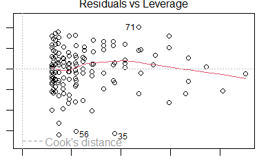

```{r}
date()
```
# Performing and interpreting regression analysis

## Data wrangling exercise

I have done the data wrangling exercise - I had problems but I got help. With the existing instructions I would not have managed it. But I got something done. When doing the analysis exercise I noticed there was something wrong with my data or the way I had saved it or the way I tried to read it to rstudio so I used the data from the link given in the instructions. I compared the data with my data and it looks the same, but something is going on. 

## Reading the raw data and exploring it

This is data from [ASSIST 2014 International survey of Approaches to Learning by Vehkalahti] (https://www.mv.helsinki.fi/home/kvehkala/JYTmooc/JYTOPKYS2-meta.txt) 

Here I have set the working directory and read the csv file (noticed later it did not work) and later read the pre-exsting table
```{r}
library(tidyverse)
setwd("C:/Users/riikk/Documents/Open data science/IODS-project/Data")
#students2014 = read_csv("learning2014.csv") This did not work so I used # later
students2014 <- read.table("https://raw.githubusercontent.com/KimmoVehkalahti/Helsinki-Open-Data-Science/master/datasets/learning2014.txt",
                           sep = ",", header = TRUE)
dim(students2014)
str(students2014)
```
Above I have also explored the dimensions of the data. Dimensions: 166_7. Structure 166 obs. of  7 variables

The data contains seven variables: 

* Age      Age (in years) derived from the date of birth
* Attitude Global attitude toward statistics
* Points   Exam points 
* gender   Gender: M (Male), F (Female), Male = 1  Female = 2
* Deep     Deep approach      (Scale: min = 1, max = 5)        
* Surf     Surface approach    (Scale: min = 1, max = 5)          
* Stra     Strategic approach    (Scale: min = 1, max = 5)  

## Summary and graphical overview of the data
Next I have summmarized the data both in text and visually. EG. The age of the participants varied between 17 and 55 (mean 25,51), the exam points varied between 7 and 33 (mean 22.72). 
```{r}
summary(students2014)
```
 
```{r}
library(GGally)
library(ggplot2)
p <- ggpairs(students2014, mapping = aes(col = gender), lower = list(combo = wrap("facethist", bins = 20)))
```

 
When exploring the data visually, it looks like there were less male participants, participating women were a bit younger, women seem to have worse attitudes. There seems to be statistically significant correlations between attitude and points, surf and attitude in males, surf and deep in males. In attitudes there seems to be a difference in distributions of male vs. female participants.  There seems to be  a lot of outliers in age, and also some in deep and attitude (male). 

## Fitted model
```{r}
my_model <- lm(points ~ attitude + stra + surf, data = students2014)
par(mar=c(1,1,1,1))
summary(my_model)
```
I chose three variables (attitude, stra, surf) and fit a regression model where exam points was the target (dependent, outcome) variable. This is __multivariable linear regression__. With this we explore the relationship between the exploratory variables (attitude, stra and surf) and the exam points.

Summary of the fitted model: 
Coefficients:
Estimate Std. Error t value Pr(>|t|)    
(Intercept)  11.0171     3.6837   2.991  0.00322 ** 
attitude      3.3952     0.5741   5.913 1.93e-08 ***
stra          0.8531     0.5416   1.575  0.11716    
surf         -0.5861     0.8014  -0.731  0.46563    
---
Signif. codes:  0 ‘***’ 0.001 ‘**’ 0.01 ‘*’ 0.05 ‘.’ 0.1 ‘ ’ 1



Only attitudes had a statistically significant relationship with points, so I removed the other variables and ran the model without them so this was __univariable linear regression__. 

```{r}
my_model <- lm(points ~ attitude, data = students2014)
summary(my_model)
```

_"R-squared is another measure of how close the data are to the fitted line. 0.0 indicates that none of the variability in the dependent is explained by the explanatory (no relationship between data points and fitted line) and 1.0 indicates that the model explains all of the variability in the dependent"_ In this case the multiple R-squared is 0.1906, meaning that only a small part of the variability is explained by attitude. 

Last I have produced diagnostic plots: Residuals vs Fitted values, Normal QQ-plot and Residuals vs Leverage. Quantile-quantile is a graphical method for comparing the distribution of our own data to a theoretical distribution, such as the normal distribution. A Q-Q plot simply plots the quantiles for our data against the theoretical quantiles for a particular distribution (the default shown below is the normal distribution). If our data follow that distribution (e.g., normal), then our data points fall on the theoretical straight line.

```{r}
plot (my_model, which = c(1,2,5))
```







The first one looks quite nice to me, as the distance of the observations from the fitted line is about the same on the left as on the right. In the second pic at the right end of the image the residuals diverge from the straight line, so this is not normally distributed totally. As I don't have much experience in this, I don't know whether this is a problem or not as most of this fits the line nicely. 

And then I ran out of time :D 
